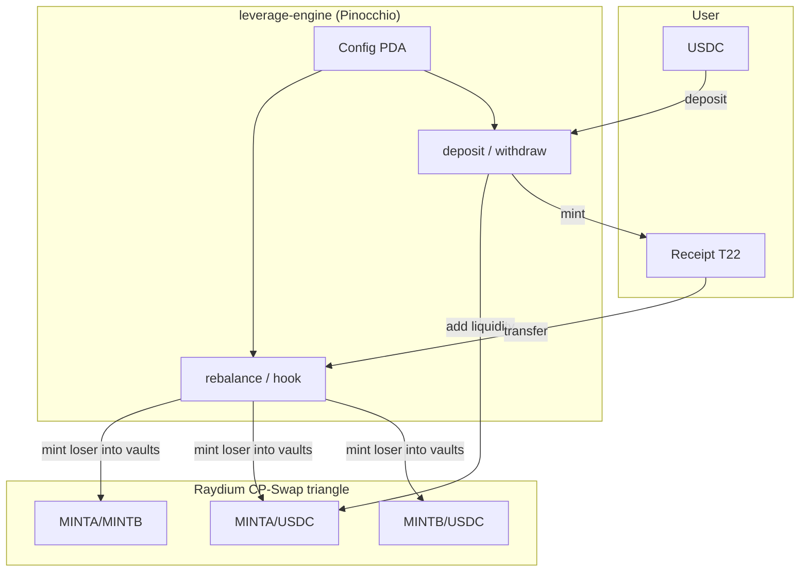

# Magical Internet Money

**Oracle-free leveraged synthetic pairs on Raydium CP-Swap, with Token-2022 receipt LPs.**

Live site: [magicalinternet.money](https://magicalinternet.money)

> **Experimental · unaudited · here be dragons.**  
> Rebalance mints the loser into **both** the pair vault and the loser/USDC vault in lockstep — so the naive cross-venue arb (buy cheap in A/B, dump into USDC) does not apply. Remaining risks are loser dilution, LP NAV bleed on sustained moves, and operational limits below. Do not deposit funds you cannot afford to lose.

---

## What it does

Magical Internet Money (MIM) lets users deposit **USDC** and receive a **receipt token** — an LP claim on a leveraged synthetic pair:

| Token | Role |
|-------|------|
| **MINTA** (+) | Leveraged-long synthetic (e.g. +5x SOL) |
| **MINTB** (−) | Inverse synthetic (e.g. −5x SOL) |
| **Receipt** | Token-2022 LP share; NAV grows as pools earn fees and absorb arb |

The pair trades on a **triangle of three Raydium CP-Swap pools**:

```text
        MINTA / MINTB          (pair pool)
           /       \
   MINTA / USDC    MINTB / USDC   (anchor pools)
```

When one synthetic underperforms, the engine **mints more of the loser directly into both pool vaults** (pair + USDC pool) so its price drops by the same fraction in each venue — no swap, no inter-pool arb gap.

A **Token-2022 transfer hook** on the receipt fires the same rebalance on every transfer (“transferrer pays”).

---

## Architecture



### Price signal (oracle-free)

No external oracle. Rebalance reads **on-chain state only**:

- 6 CP-Swap vault token balances
- 2 synthetic mint supplies
- `last_ratio` stored in Config

From these, `leverage_math::implied_market` derives the **MINTA/MINTB price ratio**. If the ratio fell since the last rebalance, MINTA underperformed → mint MINTA; if it rose, mint MINTB.

### Elastic leverage

Target leverage floats in `[L_min, L_max]` (default 2x–5x) and **decays** toward `L_min` as the loser’s minted supply grows relative to its reserve — damping that prevents a first-move runaway to zero.

Per crank, only a fraction of the ratio gap is absorbed (`CRANK_ABSORB_BPS = 30%`), with move sizing clamped between 0.75% and 2.0%.

### Safety rails

| Parameter | Purpose |
|-----------|---------|
| `max_mint_bps` | Cap mint size per rebalance (% of reserve) |
| `breaker_bps` | Circuit breaker — zero mint above this move |
| `paused` | Admin emergency stop |
| Hook soft no-op | Receipt transfers never fail on benign skip (paused / flat / throttled) |

---

## On-chain program

| | |
|---|---|
| **Mainnet program** | `J345oy4ctuut7vu9zABu9UeuSQSptVeQjmmmsi33enqe` |
| **Runtime** | Pinocchio (~48 KB binary; cheap deploy vs ~390 KB Anchor build) |
| **Economics crate** | `crates/leverage-math` (shared by Anchor + Pinocchio) |

### Pinocchio instructions

| Tag | Name | Who | What |
|-----|------|-----|------|
| 0 | `rebalance` | anyone | Permissionless crank; oracle-free mint-the-loser step |
| 1 | `init_config` | admin | Create Config PDA; record mints, pools, leverage params |
| 2 | `deposit` | anyone | USDC → CP-Swap LP + receipt mint |
| 3 | `withdraw` | anyone | Burn receipt → withdraw LP → USDC |
| 4 | `set_paused` | admin | Emergency pause |
| 5 | `update_metadata` | admin | Token-2022 receipt metadata CPI |
| 6 | `register_triangle` | admin | Introspection guard; record 3 pool IDs from same tx |
| 7 | `init_extra_account_metas` | admin | Wire transfer-hook extra accounts for receipt |
| 8–9 | `init_lut` / `extend_lut` | admin | PDA-owned address lookup table for v0 txs |
| 10 | `validate_mints` | admin | Mint validation helper |
| 11 | `buy_burn` | anyone | Buy-and-burn utility ix |
| 12 | `seed_pair` | admin | Pair seeding helper |
| 13–14 | `backfill_metaplex` / `backfill_receipt_t22` | admin | Metadata migration helpers |
| — | `transfer_hook` | Token-2022 CPI | Same rebalance path on receipt transfer |

Token layout:

- **MINTA / MINTB** — legacy SPL Token (hook can mint without re-entering Token-2022)
- **Receipt** — Token-2022 with TransferHook → program + MetadataPointer → self
- **USDC** — legacy SPL

### Anchor reference implementation

`programs/leverage-engine` is the Anchor port used for IDL-driven dev and surfpool tests. Same economics via `leverage_math`; not the mainnet deploy target due to binary size (~5.6 SOL rent vs ~0.65 SOL Pinocchio).

Local program IDs (surfpool / `anchor test`):

| Program | ID |
|---------|-----|
| `leverage_engine` | `Een1a526XFdTeSBjdBzU83sotriogcj4hBXsaCs8AaHx` |
| `transfer_hook` | `DuPvWH63wQCw9sA3KRvFuipRkLDhh2TU7gEBJTNQSij6` |

---

## Repository layout

```text
.
├── crates/leverage-math/       # Pure economics (unit-tested, no_std)
├── pinocchio-programs/
│   └── leverage-engine/        # Mainnet program (Pinocchio)
├── programs/
│   ├── leverage-engine/        # Anchor reference + IDL
│   └── transfer-hook/          # Original Anchor transfer-hook template
├── harness/                    # surfpool mainnet-fork integration tests
├── site/                       # magicalinternet.money — indexer + tx builder + UI
├── flux-router-service/        # FluxBeam pool indexer + hook-aware swap router
└── tests/                      # Anchor transfer-hook tests
```

---

## Prerequisites

| Tool | Version |
|------|---------|
| Rust | 1.86.0 (`rust-toolchain.toml`) |
| Solana / Agave | 3.1.10 |
| Anchor CLI | 0.31.1 |
| Node.js | ≥ 18 |
| Yarn | (root + harness) |

**Landmine:** `anchor build` can silently relink your active Solana install to 2.1.0. This repo pins `solana_version = "3.1.10"` in `Anchor.toml` — verify with `solana --version` if builds fail on `edition2024` deps.

**Landmine:** Agave 3.x requires `[test] upgradeable = true` in `Anchor.toml` or `anchor test` loads programs under BPFLoader2 and CPIs fail with empty logs.

---

## Build

### Economics tests (host)

```bash
cargo test -p leverage-math
```

### Anchor programs (dev / surfpool)

```bash
anchor build
cargo test -p leverage-engine --lib   # Anchor math shim tests
```

### Pinocchio program (mainnet target)

```bash
cargo build-sbf --manifest-path pinocchio-programs/leverage-engine/Cargo.toml
# Output: target/deploy/leverage_engine_pinocchio.so
```

Measured sizes: Anchor ~390 KB (~5.6 SOL deploy); Pinocchio full port ~48 KB (~0.65 SOL).

---

## Harness (mainnet fork)

Integration tests run against a **surfpool mainnet fork** so CPIs hit the real Raydium CP-Swap program (`CPMMoo8L3F4NbTegBCKVNunggL7H1ZpdTHKxQB5qKP1C`).

```bash
# Optional: fast RPC datasource (never commit API keys)
export SURFPOOL_DATASOURCE_RPC_URL="https://mainnet.helius-rpc.com/?api-key=YOUR_KEY"
export DEV_WALLET_KEY="$ANCHOR_WALLET"   # or path to a local keypair

./harness/run-surfpool.sh              # localhost:8899
./harness/run-pinocchio-rebalance.sh   # example: oracle-free rebalance on fork
./harness/run-triangle.sh              # atomic 3-pool triangle + LUT
```

See [`harness/README.md`](harness/README.md) for fixtures, artifacts, and test inventory.

### Launch a pair (fork or mainnet)

```bash
# Requires built pinocchio keypair at target/deploy/leverage_engine_pinocchio-keypair.json
export ANCHOR_PROVIDER_URL=https://api.mainnet-beta.solana.com   # or http://localhost:8899
export ANCHOR_WALLET=/path/to/admin-keypair.json
export L_SYM=5xSOL L_NAME="5x SOL LP" L_ASSET_USD=150 L_LEV=5

npx ts-node harness/launch.ts
```

Launch sequence (~11 transactions):

1. Create MINTA / MINTB (legacy SPL)
2. Create receipt (Token-2022 + TransferHook + MetadataPointer)
3. Seed synth amounts to creator
4. `init_config`
5. Atomic triangle (3 CP-Swap `initialize` + `register_triangle` in one v0 tx with LUT)
6. Transfer mint authority to program PDA
7. Initialize transfer-hook extra account metas

---

## Site

The production app at [magicalinternet.money](https://magicalinternet.money) is a zero-bundler Node server:

- **Real-data-only indexer** — discovers pairs via `getProgramAccounts`, reads vault balances + supplies, computes NAV/TVL/APY from chain state (no mocks)
- **Tx builder** — server prepares deposit/withdraw/rebalance txs; wallet signs via Wallet Standard
- **Dynamic metadata** — `/api/meta` serves MINTA/MINTB metadata off-chain via MetadataPointer URIs

### Run locally

```bash
cd site
npm install
export RPC_URL=https://api.mainnet-beta.solana.com
export PROGRAM_ID=J345oy4ctuut7vu9zABu9UeuSQSptVeQjmmmsi33enqe
npm start    # http://localhost:8080
```

### Deploy (Fly.io)

```bash
cd site
fly deploy   # app: magic-internet-money
```

Env: `SITE_ORIGIN`, `RPC_URL`, `PROGRAM_ID`, optional `DATA_DIR` for persisted chart series.

### Admin scripts

| Script | Purpose |
|--------|---------|
| `site/init-hook-metas.js` | Initialize ExtraAccountMetaList for receipt transfers |
| `site/backfill.js` | Backfill Metaplex / Token-2022 metadata |
| `site/patch-metadata.js` | Patch individual metadata fields |

All admin scripts take a keypair via `ADMIN_KEY` env or CLI arg — never commit key files.

---

## Flux router service

Separate Fly app (`mim-flux-router`) that indexes FluxBeam pools and builds swap transactions. Receipt tokens with transfer hooks are **not yet routable** through Flux — use MIM deposit/withdraw for receipt tokens until Flux forwards hook accounts.

```bash
cd flux-router-service
npm install
npm start
```

---

## Economics reference

Core logic lives in `crates/leverage-math/src/lib.rs`:

```text
loser selection:
  ratio fell  → MINTA lost relative value → mint A
  ratio rose  → MINTB lost relative value → mint B

mint sizing (simplified):
  m ≈ reserve × L × |move|
  clamped by max_mint_bps and circuit breaker

two-pool invariant:
  amount_pair / pair_reserve == amount_usdc / usdc_reserve
  (same relative price drop in both venues)
```

Run the full test suite:

```bash
cargo test -p leverage-math
```

---

## Known risks

### What the two-pool design fixes

The naive failure mode — mint only into the A/B pool, leaving a cheaper loser in the pair than in the USDC pool — **is not how this program works**. Each rebalance mints the loser **directly into both vaults** with the invariant `amount_pair / pair_reserve ≈ amount_usdc / usdc_reserve`, so both venues move by the same fraction. External arbers cannot harvest a protocol-created price gap between those two pools.

The `leverage-math` red-team drain sim (`drain_sim_protocol_never_touches_the_quote_anchor`) checks 2000 rounds: **rebalance only adds loser tokens; it never removes USDC from the anchor pools**. Quote reserves change only from external trades, not from the crank/hook path.

### What remains risky

1. **Loser dilution** — minting the underperformer still pushes its price down in both pools simultaneously. That is the leverage mechanism, not a bug, but sustained one-sided moves inflate loser supply and can erode LP backing per receipt.
2. **No restoring force** — unlike perp engines, there is no margin call, liquidation, or ADL that forces deleveraging. Elastic leverage decay and per-crank caps bound mint size; they do not guarantee NAV recovery.
3. **External market risk** — third-party swaps, routing, and macro moves still affect pool reserves and receipt NAV. The protocol does not immunize LPs against bad underlying performance.
4. **Hook CU budget** — receipt transfers carry rebalance compute; large account lists require a persistent LUT in Config.
5. **Unaudited** — no formal verification; harness tests, unit tests, and the red-team sim above only.
6. **Admin keys** — pair config, pause, and upgrade authority are high-value targets.

---

## External dependencies

| Program / mint | Address |
|----------------|---------|
| Raydium CP-Swap | `CPMMoo8L3F4NbTegBCKVNunggL7H1ZpdTHKxQB5qKP1C` |
| CP-Swap amm_config[0] | `D4FPEruKEHrG5TenZ2mpDGEfu1iUvTiqBxvpU8HLBvC2` |
| USDC | `EPjFWdd5AufqSSqeM2qN1xzybapC8G4wEGGkZwyTDt1v` |
| FluxBeam | `FLUXubRmkEi2q6K3Y9kBPg9248ggaZVsoSFhtJHSrm1X` |
| Metaplex metadata | `metaqbxxUerdq28cj1RbAWkYQm3ybzjb6a8bt518x1s` |
| Token-2022 | `TokenzQdBNbLqP5VEhdkAS6EPFLC1PHnBqCXEpPxuEb` |

---

## License

See individual program manifests. Experimental research software — use at your own risk.