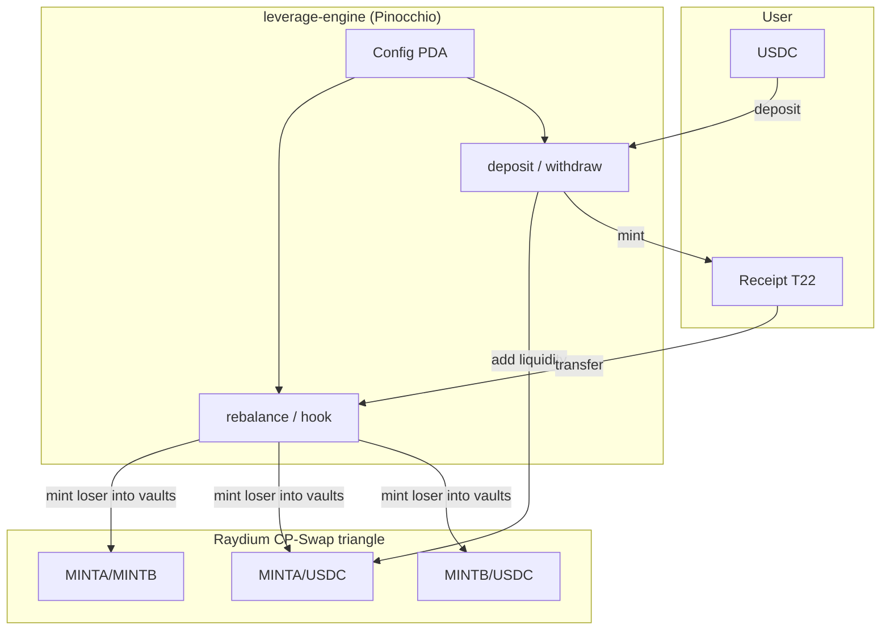

# Magical Internet Money

**Oracle-free leveraged synthetic pairs on Raydium CP-Swap, with Token-2022 receipt LPs.**

Live site: [magicalinternet.money](https://magicalinternet.money)

> **Experimental · unaudited · here be dragons.**  
> Rebalance mints the loser into **both** the pair vault and the loser/USDC vault in lockstep — the naive cross-venue arb (buy cheap in A/B, dump into USDC) does not apply. LPs earn from **Raydium swap fees + external arb volume** as synths trade on Jupiter; that is the economic loop, not a formal guarantee against sustained one-sided moves. Do not deposit funds you cannot afford to lose.

### Honest project status

| | |
|---|---|
| **Maturity** | Early-stage research software — small number of live pairs, no audit, no formal verification |
| **Mainnet program** | Pinocchio `J345oy4ctuut7vu9zABu9UeuSQSptVeQjmmmsi33enqe` — deposit/withdraw/rebalance use **real Raydium CP-Swap pool vaults** (not protocol-held reserves) |
| **Rebalance price signal** | Oracle-free: implied MINTA/MINTB ratio from on-chain vault balances + supplies. **Raydium `observation_state` TWAP is not used** |
| **Optional oracle** | PumpSwap vault read for MEME / non-Raydium underlyings (pairs can still run triangle-only) |
| **Anchor crate** | `programs/leverage-engine` is a **stale M1 reference** (protocol-held reserves) — kept for IDL/surfpool; not what ships on mainnet |
| **Rebalance (mainnet)** | Receipt **transfer hook** = rebalance crank: `TransferChecked` → `J345…` → mint loser into Raydium vaults — [proof tx](https://solscan.io/tx/Ggs5oQaXJLxy41F9z3asMtEvfrwzCyDBv1TizGxUfUgbXXLr2gNn7BkxYqHPiKDqtrmA655gWESh6g2458CMe5w) |
| **Site** | [magicalinternet.money](https://magicalinternet.money) indexes real on-chain state; launching a pair is **~10 wallet txs**, not one click |
| **Design mockup** | `site/_handoff/` is a pre-build Claude design comp — not production proof |

### On-chain verification (with receipts)

No wallet needed to sanity-check the deployment:

```bash
curl -s https://magicalinternet.money/api/status | jq .
curl -s https://magicalinternet.money/api/pairs | jq '.pairs | length'
```

**Live `/api/status`** (snapshot 2026-06-21 — no wallet; RPC host only, key server-side):

```json
{
  "programId": "J345oy4ctuut7vu9zABu9UeuSQSptVeQjmmmsi33enqe",
  "deployed": true,
  "programExecutable": true,
  "programData": "F1QCWDHFBMr1BsL7CTdetpxTbQXkzwDkQVUmy3EvknE5",
  "upgradeAuthority": "CnkHq3wRSsegjpJJvvRWb1uiCJvPMAYW6b7P1Yq8FpCT",
  "rpc": "https://mainnet.helius-rpc.com/",
  "usdcMint": "EPjFWdd5AufqSSqeM2qN1xzybapC8G4wEGGkZwyTDt1v",
  "memeMint": "CNBuoZWcqAvVZJCrPFF1XQXeeXJsZKj7SUKZoE6Vpump",
  "pairs": 5,
  "pairsWithReceiptSupply": 2,
  "maturity": "mainnet-alpha",
  "audited": false,
  "publicReadApis": ["/healthz", "/api/status", "/api/pairs", "/api/charts"],
  "walletRequiredFor": ["/api/balance", "deposit", "withdraw", "launch"],
  "raydiumLpExample": {
    "pool": "6LBJej9kh2Kzgun39dvpZzrrH73XRqw7YKXS2wjR4ku5",
    "lpMint": "9Wa74CiHe12aMQyBFitjuWhRwktGZ6hoicucUhxPX2b2"
  },
  "sampleTransactions": {
    "deposit3xSOL": "3j1nCrnG15M9ZvnDWaVQMLRtnyhqhizSG1xkLnW4ShkqhqZQebLUttwEsgDhR3rUC4fmb7iJPa4jpBYWCiQQCq5X",
    "deposit5xBTC": "4df5jUNBeEoBU4fMHcJktjWx4BE7LF1qnMXsQC8MoLRhKj6SGxQUVMVc1GX38NiLQuJLMJWJbJTREjeZpebGwUSs",
    "depositLEV": "3mDnbYNMhVko2evpnfm2Cu8SvcqfGEGKtUeZcQ3R1Zod5jE9DGCyeWMT1xm1RGGmWd9jgAPth9C8ZeA5yL4ZNUiG",
    "withdraw": "jXfNVqUNBSY9e5XZ6v3PKDr7qujGcfsFmU7Xd2kjPXCVmRXtamLtYa6adPccrKYT41LwBEwqRLUj8KtCkciK6kM",
    "initConfig": "N5RhLJYiZKHew3GRc3SgzgTQXsSer1BacEX7Tz68iMGEVMbzMJ9o4G7Wiegx8JLoFM7zVHhUmScGsrV885pAFm6",
    "registerTriangle": "4VR9HkYA73Y7hckoriVYkpffrCagAe92s2qBSRKayrJAiMt5BBvUAxTExRjzWaSyuoNXEVBav2JH4CTBJHLquXZF",
    "initHook": "5J8kViDMZKJkJ79Y4uwnj2tMiih5WbiTy3r6AmV59Lqx3t5Q63q85H24tzk7ZfDR7F1Lv2gKhyUUAynAnKKDmUnr",
    "backfillMetaplex": "2pX8NSLA1knyhJKE6Na6y3x37YNxLM6sG6AD8LF65qeTK3wtNoTstT86jwD1mt34WPbdsCiLgfGA6JJ2Mj9rQLdD",
    "backfillReceipt": "3669NsGKkd21fw4MjZSChcU3WumVYigpvRd4kTJopU7dSY6HLVNzzVQYgCuKi2U5zDvqBfYciEDsciDgPEu4t1r2",
    "updateMetadata": "2q5V3DVx2d6pXuUCwJfGK6uKreZbjwv9w2YuPeigJNmf3BspC8osRipYyWZMFHSF1ZNBhKAaCbV7JTDjYq9kXqo3",
    "rebalance3xSOL": "Ggs5oQaXJLxy41F9z3asMtEvfrwzCyDBv1TizGxUfUgbXXLr2gNn7BkxYqHPiKDqtrmA655gWESh6g2458CMe5w",
    "rebalanceReceiptTransfer": "48Vj2Afb9rgRP941smC5QMjeMKk7KwMjLcVDQefYpaYiDZKE87m5m8g597zQxF4MHwCvvwVebg9y8NbHEbJGRt3Y",
    "raydiumLpMintActivity": "3Lb58HxGBkwE8QwxZkkw1GsKs6CLBBHbXqH34VhEShz3CLKY2nVdJ4t3gBRhMTUAX2z8yrkGh8BxBG9hgwNNupJ4"
  },
  "rebalanceObservedOnMainnet": true,
  "rebalancePath": "receipt_transfer_hook",
  "verify": {
    "program": "https://solscan.io/account/J345oy4ctuut7vu9zABu9UeuSQSptVeQjmmmsi33enqe",
    "programData": "https://solscan.io/account/F1QCWDHFBMr1BsL7CTdetpxTbQXkzwDkQVUmy3EvknE5",
    "upgradeAuthority": "https://solscan.io/account/CnkHq3wRSsegjpJJvvRWb1uiCJvPMAYW6b7P1Yq8FpCT",
    "memeMint": "https://solscan.io/token/CNBuoZWcqAvVZJCrPFF1XQXeeXJsZKj7SUKZoE6Vpump",
    "txUrlPrefix": "https://solscan.io/tx/"
  },
  "notes": [
    "Pinocchio mainnet: deposit/withdraw CPI into Raydium CP-Swap pool vaults (see sample txs + LP mint activity).",
    "Rebalance on mainnet: receipt TransferChecked → J345… → mint loser into Raydium vaults (sample rebalance3xSOL).",
    "Launch is ~10 wallet-approved txs, not a single click.",
    "site/_handoff/ is a pre-build Claude design mockup, not production proof.",
    "Public read APIs work without a wallet: /api/status, /api/pairs, /api/charts."
  ]
}
```

**Solscan links** (same fields as `/api/status` → `verify` + `sampleTransactions`):

| `verify` / accounts | Solscan |
|---------------------|---------|
| `program` | [J345oy4ctuut7vu9zABu9UeuSQSptVeQjmmmsi33enqe](https://solscan.io/account/J345oy4ctuut7vu9zABu9UeuSQSptVeQjmmmsi33enqe) |
| `programData` | [F1QCWDHFBMr1BsL7CTdetpxTbQXkzwDkQVUmy3EvknE5](https://solscan.io/account/F1QCWDHFBMr1BsL7CTdetpxTbQXkzwDkQVUmy3EvknE5) |
| `upgradeAuthority` | [CnkHq3wRSsegjpJJvvRWb1uiCJvPMAYW6b7P1Yq8FpCT](https://solscan.io/account/CnkHq3wRSsegjpJJvvRWb1uiCJvPMAYW6b7P1Yq8FpCT) |
| `memeMint` | [CNBuoZWcqAvVZJCrPFF1XQXeeXJsZKj7SUKZoE6Vpump](https://solscan.io/token/CNBuoZWcqAvVZJCrPFF1XQXeeXJsZKj7SUKZoE6Vpump) |
| `raydiumLpExample.pool` (3xSOL A/B) | [6LBJej9kh2Kzgun39dvpZzrrH73XRqw7YKXS2wjR4ku5](https://solscan.io/account/6LBJej9kh2Kzgun39dvpZzrrH73XRqw7YKXS2wjR4ku5) |
| `raydiumLpExample.lpMint` | [9Wa74CiHe12aMQyBFitjuWhRwktGZ6hoicucUhxPX2b2](https://solscan.io/account/9Wa74CiHe12aMQyBFitjuWhRwktGZ6hoicucUhxPX2b2) |

| `sampleTransactions` key | Solscan tx |
|--------------------------|------------|
| `deposit3xSOL` | [3j1nCrnG15M9ZvnDWaVQMLRtnyhqhizSG1xkLnW4ShkqhqZQebLUttwEsgDhR3rUC4fmb7iJPa4jpBYWCiQQCq5X](https://solscan.io/tx/3j1nCrnG15M9ZvnDWaVQMLRtnyhqhizSG1xkLnW4ShkqhqZQebLUttwEsgDhR3rUC4fmb7iJPa4jpBYWCiQQCq5X) |
| `deposit5xBTC` | [4df5jUNBeEoBU4fMHcJktjWx4BE7LF1qnMXsQC8MoLRhKj6SGxQUVMVc1GX38NiLQuJLMJWJbJTREjeZpebGwUSs](https://solscan.io/tx/4df5jUNBeEoBU4fMHcJktjWx4BE7LF1qnMXsQC8MoLRhKj6SGxQUVMVc1GX38NiLQuJLMJWJbJTREjeZpebGwUSs) |
| `depositLEV` | [3mDnbYNMhVko2evpnfm2Cu8SvcqfGEGKtUeZcQ3R1Zod5jE9DGCyeWMT1xm1RGGmWd9jgAPth9C8ZeA5yL4ZNUiG](https://solscan.io/tx/3mDnbYNMhVko2evpnfm2Cu8SvcqfGEGKtUeZcQ3R1Zod5jE9DGCyeWMT1xm1RGGmWd9jgAPth9C8ZeA5yL4ZNUiG) |
| `withdraw` | [jXfNVqUNBSY9e5XZ6v3PKDr7qujGcfsFmU7Xd2kjPXCVmRXtamLtYa6adPccrKYT41LwBEwqRLUj8KtCkciK6kM](https://solscan.io/tx/jXfNVqUNBSY9e5XZ6v3PKDr7qujGcfsFmU7Xd2kjPXCVmRXtamLtYa6adPccrKYT41LwBEwqRLUj8KtCkciK6kM) |
| `initConfig` | [N5RhLJYiZKHew3GRc3SgzgTQXsSer1BacEX7Tz68iMGEVMbzMJ9o4G7Wiegx8JLoFM7zVHhUmScGsrV885pAFm6](https://solscan.io/tx/N5RhLJYiZKHew3GRc3SgzgTQXsSer1BacEX7Tz68iMGEVMbzMJ9o4G7Wiegx8JLoFM7zVHhUmScGsrV885pAFm6) |
| `registerTriangle` | [4VR9HkYA73Y7hckoriVYkpffrCagAe92s2qBSRKayrJAiMt5BBvUAxTExRjzWaSyuoNXEVBav2JH4CTBJHLquXZF](https://solscan.io/tx/4VR9HkYA73Y7hckoriVYkpffrCagAe92s2qBSRKayrJAiMt5BBvUAxTExRjzWaSyuoNXEVBav2JH4CTBJHLquXZF) |
| `initHook` | [5J8kViDMZKJkJ79Y4uwnj2tMiih5WbiTy3r6AmV59Lqx3t5Q63q85H24tzk7ZfDR7F1Lv2gKhyUUAynAnKKDmUnr](https://solscan.io/tx/5J8kViDMZKJkJ79Y4uwnj2tMiih5WbiTy3r6AmV59Lqx3t5Q63q85H24tzk7ZfDR7F1Lv2gKhyUUAynAnKKDmUnr) |
| `backfillMetaplex` | [2pX8NSLA1knyhJKE6Na6y3x37YNxLM6sG6AD8LF65qeTK3wtNoTstT86jwD1mt34WPbdsCiLgfGA6JJ2Mj9rQLdD](https://solscan.io/tx/2pX8NSLA1knyhJKE6Na6y3x37YNxLM6sG6AD8LF65qeTK3wtNoTstT86jwD1mt34WPbdsCiLgfGA6JJ2Mj9rQLdD) |
| `backfillReceipt` | [3669NsGKkd21fw4MjZSChcU3WumVYigpvRd4kTJopU7dSY6HLVNzzVQYgCuKi2U5zDvqBfYciEDsciDgPEu4t1r2](https://solscan.io/tx/3669NsGKkd21fw4MjZSChcU3WumVYigpvRd4kTJopU7dSY6HLVNzzVQYgCuKi2U5zDvqBfYciEDsciDgPEu4t1r2) |
| `updateMetadata` | [2q5V3DVx2d6pXuUCwJfGK6uKreZbjwv9w2YuPeigJNmf3BspC8osRipYyWZMFHSF1ZNBhKAaCbV7JTDjYq9kXqo3](https://solscan.io/tx/2q5V3DVx2d6pXuUCwJfGK6uKreZbjwv9w2YuPeigJNmf3BspC8osRipYyWZMFHSF1ZNBhKAaCbV7JTDjYq9kXqo3) |
| **`rebalance3xSOL`** | [Ggs5oQaXJLxy41F9z3asMtEvfrwzCyDBv1TizGxUfUgbXXLr2gNn7BkxYqHPiKDqtrmA655gWESh6g2458CMe5w](https://solscan.io/tx/Ggs5oQaXJLxy41F9z3asMtEvfrwzCyDBv1TizGxUfUgbXXLr2gNn7BkxYqHPiKDqtrmA655gWESh6g2458CMe5w) — **rebalance via receipt transfer hook**: 1× 3xSOL receipt sent to recipient → `TransferChecked` → `J345…` → mint into Raydium vault authority (+/− legs) |
| `rebalanceReceiptTransfer` | [48Vj2Afb9rgRP941smC5QMjeMKk7KwMjLcVDQefYpaYiDZKE87m5m8g597zQxF4MHwCvvwVebg9y8NbHEbJGRt3Y](https://solscan.io/tx/48Vj2Afb9rgRP941smC5QMjeMKk7KwMjLcVDQefYpaYiDZKE87m5m8g597zQxF4MHwCvvwVebg9y8NbHEbJGRt3Y) — earlier rebalance hook sample |
| `raydiumLpMintActivity` | [3Lb58HxGBkwE8QwxZkkw1GsKs6CLBBHbXqH34VhEShz3CLKY2nVdJ4t3gBRhMTUAX2z8yrkGh8BxBG9hgwNNupJ4](https://solscan.io/tx/3Lb58HxGBkwE8QwxZkkw1GsKs6CLBBHbXqH34VhEShz3CLKY2nVdJ4t3gBRhMTUAX2z8yrkGh8BxBG9hgwNNupJ4) |

Deposit/withdraw txs show **Raydium CP-Swap `Deposit` / `Withdraw` CPI** in logs.

**Rebalance on mainnet** = receipt transfer hook (same instruction path, not a separate feature). Send receipt to any wallet → [`rebalance3xSOL`](https://solscan.io/tx/Ggs5oQaXJLxy41F9z3asMtEvfrwzCyDBv1TizGxUfUgbXXLr2gNn7BkxYqHPiKDqtrmA655gWESh6g2458CMe5w) shows `TransferChecked` → `J345…` → mint into **Raydium vault authority**.

**What this proves vs. does not:**

- ✅ Program is deployed; deposit/withdraw hit **real Raydium CP-Swap vaults** (not the Anchor reference’s protocol-held reserves).
- ✅ **Rebalance** fires on mainnet via receipt transfer hook (mint loser into Raydium vaults — see Solscan mint lines on hook tx).
- ✅ Triangle pools exist on-chain; LP positions accrue to the protocol authority PDA.
- ⏳ Raydium `observation_state` TWAP is **not** the rebalance price input (oracle-free vault-implied ratio instead).
- ⚠️ Early alpha — unaudited, few pairs, no guarantee of volume or NAV stability.

---

## What it does

Magical Internet Money (MIM) lets users deposit **USDC** and receive a **receipt token** — an LP claim on a leveraged synthetic pair:

| Token | Role |
|-------|------|
| **MINTA** (+) | Leveraged-long synthetic (e.g. +5x SOL) |
| **MINTB** (−) | Inverse synthetic (e.g. −5x SOL) |
| **Receipt** | Token-2022 LP share; NAV grows as pools earn fees and absorb arb |

The pair trades on a **triangle of three Raydium CP-Swap pools**:

```text
        MINTA / MINTB          (pair pool)
           /       \
   MINTA / USDC    MINTB / USDC   (anchor pools)
```

When one synthetic underperforms, the engine **mints more of the loser directly into both pool vaults** (pair + USDC pool) so its price drops by the same fraction in each venue — no swap, no inter-pool arb gap.

The receipt is **Token-2022 with a transfer hook** — that hook *is* rebalance. Every receipt transfer runs mint-the-loser into Raydium vaults (“transferrer pays”).

---

## Architecture



### Price signal (oracle-free)

No external oracle. Rebalance reads **on-chain state only**:

- 6 CP-Swap vault token balances
- 2 synthetic mint supplies
- `last_ratio` stored in Config

From these, `leverage_math::implied_market` derives the **MINTA/MINTB price ratio**. If the ratio fell since the last rebalance, MINTA underperformed → mint MINTA; if it rose, mint MINTB.

### Rebalance mechanics

**Two-pool mint.** The loser is minted directly into both vaults it lives in (A/B pair + loser/USDC) with matched fractions: `amount_pair / pair_reserve ≈ amount_usdc / usdc_reserve`. Both venues move together — no protocol-created price gap to arb between them. Rebalance only **adds** loser tokens; it never pulls USDC out of anchor pools (see red-team test `drain_sim_protocol_never_touches_the_quote_anchor`).

**Elastic leverage decay** (`elastic_leverage_bps`) is a **safety throttle**, not a bug: as loser supply grows relative to reserve, target leverage falls from `L_max` toward `L_min` (default 5x → 2x), so an already-inflated side cannot keep getting hammered at full power. AMM fees do not change this math — they are a separate LP revenue stream (below).

**Crank pacing.** Per fire, only 30% of the ratio gap is absorbed (`CRANK_ABSORB_BPS`), with move sizing clamped between 0.75% and 2.0%.

### LP economics (fees + arb)

Receipt holders own the protocol's CP-Swap LP positions. Their yield comes from:

| Source | What it does |
|--------|----------------|
| **Raydium swap fees** | Every Jupiter/Flux swap through the triangle pays CP-Swap fees → accrues to LP → grows receipt NAV |
| **External arb** | Traders correct mispricing between pools and external markets → volume + fees |
| **Deposit skim** | Optional `fee_bps` on deposit → `fee_vault` → permissionless `buy_burn` (USDC → MEME swap + burn) |

Mint-the-loser **dilutes** the underperforming synthetic (intentional leverage). Fees and arb **compensate** LPs for providing that exposure — the site APY is observed NAV growth from real pool state. High volume can offset dilution; low volume or a sustained one-sided trend can still erode backing per receipt. There is no margin call or ADL — the upside case is trading activity, not a mechanical price restore.

### Safety rails

| Parameter | Purpose |
|-----------|---------|
| `max_mint_bps` | Cap mint size per rebalance (% of reserve) |
| `breaker_bps` | Circuit breaker — zero mint above this move |
| `paused` | Admin emergency stop |
| Hook soft no-op | Receipt transfers never fail on benign skip (paused / flat / throttled) |

---

## On-chain program

| | |
|---|---|
| **Mainnet program** | `J345oy4ctuut7vu9zABu9UeuSQSptVeQjmmmsi33enqe` |
| **Runtime** | Pinocchio (~48 KB binary; cheap deploy vs ~390 KB Anchor build) |
| **Economics crate** | `crates/leverage-math` (shared by Anchor + Pinocchio) |

### Pinocchio instructions

| Tag | Name | Who | What |
|-----|------|-----|------|
| 0 | `rebalance` | anyone | Mint-the-loser logic (oracle-free). **On mainnet this runs inside the receipt transfer hook**, not as a standalone wallet tx |
| 1 | `init_config` | admin | Create Config PDA; record mints, pools, leverage params |
| 2 | `deposit` | anyone | USDC → CP-Swap LP + receipt mint |
| 3 | `withdraw` | anyone | Burn receipt → withdraw LP → USDC |
| 4 | `set_paused` | admin | Emergency pause |
| 5 | `update_metadata` | admin | Token-2022 receipt metadata CPI |
| 6 | `register_triangle` | admin | Introspection guard; record 3 pool IDs from same tx |
| 7 | `init_extra_account_metas` | admin | Wire transfer-hook extra accounts for receipt |
| 8–9 | `init_lut` / `extend_lut` | admin | PDA-owned address lookup table for v0 txs |
| 10 | `validate_mints` | admin | Mint validation helper |
| 11 | `buy_burn` | anyone | Swap accrued deposit fees (USDC) → MEME via pinned pool, then burn |
| 12 | `seed_pair` | admin | Pair seeding helper |
| 13–14 | `backfill_metaplex` / `backfill_receipt_t22` | admin | Metadata migration helpers |
| — | `transfer_hook` | Token-2022 CPI | **Production rebalance path** — receipt `TransferChecked` invokes program → Raydium vault mints |

Token layout:

- **MINTA / MINTB** — legacy SPL Token (hook can mint without re-entering Token-2022)
- **Receipt** — Token-2022 with TransferHook → program + MetadataPointer → self
- **USDC** — legacy SPL

### Anchor reference implementation

`programs/leverage-engine` is the Anchor port used for IDL-driven dev and surfpool tests. Same economics via `leverage_math`; not the mainnet deploy target due to binary size (~5.6 SOL rent vs ~0.65 SOL Pinocchio).

Local program IDs (surfpool / `anchor test`):

| Program | ID |
|---------|-----|
| `leverage_engine` | `Een1a526XFdTeSBjdBzU83sotriogcj4hBXsaCs8AaHx` |
| `transfer_hook` | `DuPvWH63wQCw9sA3KRvFuipRkLDhh2TU7gEBJTNQSij6` |

---

## Repository layout

```text
.
├── crates/leverage-math/       # Pure economics (unit-tested, no_std)
├── pinocchio-programs/
│   └── leverage-engine/        # Mainnet program (Pinocchio)
├── programs/
│   ├── leverage-engine/        # Anchor reference + IDL
│   └── transfer-hook/          # Original Anchor transfer-hook template
├── harness/                    # surfpool mainnet-fork integration tests
├── site/                       # magicalinternet.money — indexer + tx builder + UI
├── flux-router-service/        # FluxBeam pool indexer + hook-aware swap router
└── tests/                      # Anchor transfer-hook tests
```

---

## Prerequisites

| Tool | Version |
|------|---------|
| Rust | 1.86.0 (`rust-toolchain.toml`) |
| Solana / Agave | 3.1.10 |
| Anchor CLI | 0.31.1 |
| Node.js | ≥ 18 |
| Yarn | (root + harness) |

**Landmine:** `anchor build` can silently relink your active Solana install to 2.1.0. This repo pins `solana_version = "3.1.10"` in `Anchor.toml` — verify with `solana --version` if builds fail on `edition2024` deps.

**Landmine:** Agave 3.x requires `[test] upgradeable = true` in `Anchor.toml` or `anchor test` loads programs under BPFLoader2 and CPIs fail with empty logs.

---

## Build

### Economics tests (host)

```bash
cargo test -p leverage-math
```

### Anchor programs (dev / surfpool)

```bash
anchor build
cargo test -p leverage-engine --lib   # Anchor math shim tests
```

### Pinocchio program (mainnet target)

```bash
cargo build-sbf --manifest-path pinocchio-programs/leverage-engine/Cargo.toml
# Output: target/deploy/leverage_engine_pinocchio.so
```

Measured sizes: Anchor ~390 KB (~5.6 SOL deploy); Pinocchio full port ~48 KB (~0.65 SOL).

---

## Harness (mainnet fork)

Integration tests run against a **surfpool mainnet fork** so CPIs hit the real Raydium CP-Swap program (`CPMMoo8L3F4NbTegBCKVNunggL7H1ZpdTHKxQB5qKP1C`).

```bash
# Optional: fast RPC datasource (never commit API keys)
export SURFPOOL_DATASOURCE_RPC_URL="https://mainnet.helius-rpc.com/?api-key=YOUR_KEY"
export DEV_WALLET_KEY="$ANCHOR_WALLET"   # or path to a local keypair

./harness/run-surfpool.sh              # localhost:8899
./harness/run-pinocchio-rebalance.sh   # example: oracle-free rebalance on fork
./harness/run-triangle.sh              # atomic 3-pool triangle + LUT
```

See [`harness/README.md`](harness/README.md) for fixtures, artifacts, and test inventory.

### Launch a pair (fork or mainnet)

```bash
# Requires built pinocchio keypair at target/deploy/leverage_engine_pinocchio-keypair.json
export ANCHOR_PROVIDER_URL=https://api.mainnet-beta.solana.com   # or http://localhost:8899
export ANCHOR_WALLET=/path/to/admin-keypair.json
export L_SYM=5xSOL L_NAME="5x SOL LP" L_ASSET_USD=150 L_LEV=5

npx ts-node harness/launch.ts
```

Launch sequence (~11 transactions):

1. Create MINTA / MINTB (legacy SPL)
2. Create receipt (Token-2022 + TransferHook + MetadataPointer)
3. Seed synth amounts to creator
4. `init_config`
5. Atomic triangle (3 CP-Swap `initialize` + `register_triangle` in one v0 tx with LUT)
6. Transfer mint authority to program PDA
7. Initialize transfer-hook extra account metas

---

## Site

The production app at [magicalinternet.money](https://magicalinternet.money) is a zero-bundler Node server:

- **Real-data-only indexer** — discovers pairs via `getProgramAccounts`, reads vault balances + supplies, computes NAV/TVL/APY from chain state (no mocks)
- **Tx builder** — server prepares deposit/withdraw/rebalance txs; wallet signs via Wallet Standard
- **Dynamic metadata** — `/api/meta` serves MINTA/MINTB metadata off-chain via MetadataPointer URIs

### Run locally

```bash
cd site
npm install
export RPC_URL=https://api.mainnet-beta.solana.com
export PROGRAM_ID=J345oy4ctuut7vu9zABu9UeuSQSptVeQjmmmsi33enqe
npm start    # http://localhost:8080
```

### Deploy (Fly.io)

```bash
cd site
fly deploy   # app: magic-internet-money
```

Env: `SITE_ORIGIN`, `RPC_URL`, `PROGRAM_ID`, optional `DATA_DIR` for persisted chart series.

### Admin scripts

| Script | Purpose |
|--------|---------|
| `site/init-hook-metas.js` | Initialize ExtraAccountMetaList for receipt transfers |
| `site/backfill.js` | Backfill Metaplex / Token-2022 metadata |
| `site/patch-metadata.js` | Patch individual metadata fields |

All admin scripts take a keypair via `ADMIN_KEY` env or CLI arg — never commit key files.

---

## Flux router service

Separate Fly app (`mim-flux-router`) that indexes FluxBeam pools and builds swap transactions. Receipt tokens with transfer hooks are **not yet routable** through Flux — use MIM deposit/withdraw for receipt tokens until Flux forwards hook accounts.

```bash
cd flux-router-service
npm install
npm start
```

---

## Economics reference

Core logic lives in `crates/leverage-math/src/lib.rs`:

```text
loser selection (oracle-free):
  A/B ratio fell since last_ratio → MINTA underperformed → mint A
  A/B ratio rose                  → MINTB underperformed → mint B

mint sizing:
  m ≈ reserve × min(user_leverage, elastic_leverage) × |move|
  elastic_leverage decays L_max → L_min as supply / (supply + reserve) grows
  clamped by max_mint_bps and circuit breaker

two-pool invariant:
  amount_pair / pair_reserve ≈ amount_usdc / usdc_reserve
  (both venues move by the same fraction — no inter-venue arb gap)

LP yield (off-chain, from trading):
  Raydium fees on triangle swaps → protocol LP positions → receipt NAV
```

Run the full test suite (includes red-team fuzz + drain sim):

```bash
cargo test -p leverage-math
```

---

## Safety model

### Built-in protections

| Mechanism | Role |
|-----------|------|
| **Two-pool mint** | Eliminates buy-cheap-in-pair / dump-to-USDC exploit from rebalance alone |
| **Elastic leverage decay** | Throttles mint aggression as loser supply bloats |
| **`max_mint_bps` + circuit breaker** | Per-crank caps; zero mint on extreme moves |
| **Crank absorb + move clamps** | Small, frequent steps instead of one-shot dumps |
| **Hook soft no-op** | Receipt transfers never brick on benign skip |
| **Raydium fees + arb volume** | LP revenue loop — compensates for dilution when trading is active |

### What is not guaranteed

1. **NAV vs dilution** — rebalance dilutes the loser by design. Fees and arb can grow NAV faster than dilution erodes it, but that depends on real trading volume — not proven for every market regime.
2. **Sustained one-sided trends** — a long run in one direction keeps minting the same loser (at decaying leverage). Elastic decay bounds per-crank size; it does not force a price recovery.
3. **External market risk** — macro moves, low liquidity, and third-party routing still move pool reserves and receipt backing.
4. **Hook CU budget** — receipt transfers carry rebalance compute; large account lists require a persistent LUT in Config.
5. **Unaudited** — harness tests, unit tests, and red-team sims only; no formal verification.
6. **Admin keys** — pair config, pause, and upgrade authority are high-value targets.

---

## External dependencies

| Program / mint | Address |
|----------------|---------|
| Raydium CP-Swap | `CPMMoo8L3F4NbTegBCKVNunggL7H1ZpdTHKxQB5qKP1C` |
| CP-Swap amm_config[0] | `D4FPEruKEHrG5TenZ2mpDGEfu1iUvTiqBxvpU8HLBvC2` |
| USDC | `EPjFWdd5AufqSSqeM2qN1xzybapC8G4wEGGkZwyTDt1v` |
| FluxBeam | `FLUXubRmkEi2q6K3Y9kBPg9248ggaZVsoSFhtJHSrm1X` |
| Metaplex metadata | `metaqbxxUerdq28cj1RbAWkYQm3ybzjb6a8bt518x1s` |
| Token-2022 | `TokenzQdBNbLqP5VEhdkAS6EPFLC1PHnBqCXEpPxuEb` |

---

## License

See individual program manifests. Experimental research software — use at your own risk.